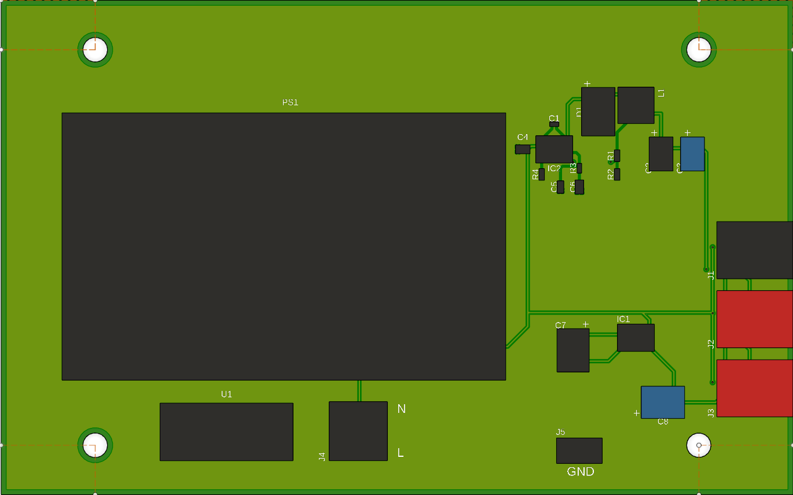

# Orborne 1 Power Supply

A new power supply for the Orborne 1 Computer.
Is a new power supply using a Meanwell power module.

## Bill of Materials

| Part | Value | Device | Footprint Name | Detailed Description | DESCRIPTION | HEIGHT | MANUFACTURER_NAME | MANUFACTURER_PART_NUMBER | MOUSER_PART_NUMBER | MOUSER_PRICE-STOCK |
| --- | --- | --- | --- | --- | --- | --- | --- | --- | --- | --- |
| C1 | GRM155R71A104KA01D | GRM155R71A104KA01D | CAPC1005X55N | Ceramic  SMT capacitor 100nF 10Vdc Murata 0402 GRM 100nF Ceramic Multilayer Capacitor, 10 V dc X7R Dielectric ??10% | Ceramic  SMT capacitor 100nF 10Vdc Murata 0402 GRM 100nF Ceramic Multilayer Capacitor, 10 V dc X7R Dielectric ??10% | 0.55mm | Murata Electronics | GRM155R71A104KA01D | 81-GRM155R71A104KA1D | https://www.mouser.co.uk/ProductDetail/Murata-Electronics/GRM155R71A104KA01D?qs=8YPuuxuUzMIpJ%252BESZ%2Fj8CQ%3D%3D |
| C2 | 10TPE47MAZB | 10TPE47MAZB | POSCAP_B1_B1S_B1G_B15G_B2_B2S | Capacitor Tantalum TPE series 10V 47uF Panasonic 47uF SMD Solid Polymer Tantalum Capacitor, 10 V dc +/-20%, POSCAP Series | Capacitor Tantalum TPE series 10V 47uF Panasonic 47uF SMD Solid Polymer Tantalum Capacitor, 10 V dc +/-20%, POSCAP Series | mm | Panasonic | 10TPE47MAZB | 667-10TPE47MAZB | https://www.mouser.co.uk/ProductDetail/Panasonic/10TPE47MAZB?qs=OE1iw1LrrPFA5jtx2CbXHA%3D%3D |
| C3 | 10TPE47MAZB | 10TPE47MAZB | POSCAP_B1_B1S_B1G_B15G_B2_B2S | Capacitor Tantalum TPE series 10V 47uF Panasonic 47uF SMD Solid Polymer Tantalum Capacitor, 10 V dc +/-20%, POSCAP Series | Capacitor Tantalum TPE series 10V 47uF Panasonic 47uF SMD Solid Polymer Tantalum Capacitor, 10 V dc +/-20%, POSCAP Series | mm | Panasonic | 10TPE47MAZB | 667-10TPE47MAZB | https://www.mouser.co.uk/ProductDetail/Panasonic/10TPE47MAZB?qs=OE1iw1LrrPFA5jtx2CbXHA%3D%3D |
| C4 | C2012X5R1H475K125AB | C2012X5R1H475K125AB | CAPC2012X145N | MULTILAYER CERAMIC CHIP CAPACITORS, 2012, Commercial grade, general (Up to 75V) | MULTILAYER CERAMIC CHIP CAPACITORS, 2012, Commercial grade, general (Up to 75V) | 1.45mm | TDK | C2012X5R1H475K125AB | 810-C2012X5R1H475K | https://www.mouser.co.uk/ProductDetail/TDK/C2012X5R1H475K125AB?qs=NRhsANhppD%252BC04rCIKmBpA%3D%3D |
| C5 | 06031U6R8BAT2A | 06031U6R8BAT2A | CAPC1608X90N | Multilayer Ceramic Capacitors MLCC - SMD/SMT 100V 6.8pF C0G 0603 0.1pF | Multilayer Ceramic Capacitors MLCC - SMD/SMT 100V 6.8pF C0G 0603 0.1pF | 0.9mm | Kyocera AVX | 06031U6R8BAT2A | 581-06031U6R8BAT2A | https://www.mouser.co.uk/ProductDetail/AVX/06031U6R8BAT2A?qs=ahudlVbFbas5u9ZWbUsx4w%3D%3D |
| C6 | CL21C222JBFNNNE | CL21C222JBFNNNE | CAPC2012X135N | Samsung Electro-Mechanics 0805 (2012M) 2.2nF MLCC 50V dc +/-5% SMD CL21C222JBFNNNE | Samsung Electro-Mechanics 0805 (2012M) 2.2nF MLCC 50V dc +/-5% SMD CL21C222JBFNNNE | 1.35mm | SAMSUNG | CL21C222JBFNNNE | 187-CL21C222JBFNNNE | https://www.mouser.co.uk/ProductDetail/Samsung-Electro-Mechanics/CL21C222JBFNNNE?qs=349EhDEZ59r2o3fpAuNjEQ%3D%3D |
| C7 | 875105359001 | 875105359001 | CAPAE530X580N | WCAP-PSLP Aluminum Polymer Capacitor | WCAP-PSLP Aluminum Polymer Capacitor | 5.8mm | Wurth Elektronik | 875105359001 | 710-875105359001 | https://www.mouser.co.uk/ProductDetail/Wurth-Elektronik/875105359001?qs=0KOYDY2FL299l4%2FtytGDVQ%3D%3D |
| C8 | 875105359001 | 875105359001 | CAPAE530X580N | WCAP-PSLP Aluminum Polymer Capacitor | WCAP-PSLP Aluminum Polymer Capacitor | 5.8mm | Wurth Elektronik | 875105359001 | 710-875105359001 | https://www.mouser.co.uk/ProductDetail/Wurth-Elektronik/875105359001?qs=0KOYDY2FL299l4%2FtytGDVQ%3D%3D |
| D1 | CDBC540-G | CDBC540-G | DIOM8059X290N | COMCHIP TECHNOLOGY CDBC540-G, SMT Schottky Diode, 40V 5A, 2-Pin DO-214AB (SMC) | COMCHIP TECHNOLOGY CDBC540-G, SMT Schottky Diode, 40V 5A, 2-Pin DO-214AB (SMC) | 2.9mm | Comchip Technology | CDBC540-G | 750-CDBC540-G | https://www.mouser.co.uk/ProductDetail/Comchip-Technology/CDBC540-G?qs=tw%252BuQ%2FB6PO2ExpPYY64Vzw%3D%3D |
| IC1 | ICL7662CBA+ | ICL7662CBA+ | SOIC127P600X175-8N | ICL7662CBA+, Charge Pump Inverting, Step Up, -20 to -4.5V, 8-Pin, SOIC | ICL7662CBA+, Charge Pump Inverting, Step Up, -20 to -4.5V, 8-Pin, SOIC | 1.75mm | Analog Devices | ICL7662CBA+ | 700-ICL7662CBA | https://www.mouser.co.uk/ProductDetail/Analog-Devices-Maxim-Integrated/ICL7662CBA%2b?qs=0Y9aZN%252BMVCXxWqkDsFqq9Q%3D%3D |
| IC2 | TPS54560BDDA | TPS54560BDDA | SOIC127P600X170-8N | Switching Voltage Regulators A 595-TPS54560BDDAR | Switching Voltage Regulators A 595-TPS54560BDDAR | 1.7mm | Texas Instruments | TPS54560BDDA | 595-TPS54560BDDA | https://www.mouser.co.uk/ProductDetail/Texas-Instruments/TPS54560BDDA?qs=gZXFycFWdAMqSdZZ7nACGQ%3D%3D |
| J1 | 22-05-1042 | 22-05-1042 | 22051042 | Headers & Wire Housings .098 HDR RA 4P 2.5mm ctrs | Headers & Wire Housings .098 HDR RA 4P 2.5mm ctrs | 11.92mm | Molex | 22-05-1042 | 538-22-05-1042 | https://www.mouser.co.uk/ProductDetail/Molex/22-05-1042?qs=jsoPY5EnoNsaw4hmaEtAeg%3D%3D |
| J2 | 22-05-1042 | 22-05-1042 | 22051042 | Headers & Wire Housings .098 HDR RA 4P 2.5mm ctrs | Headers & Wire Housings .098 HDR RA 4P 2.5mm ctrs | 11.92mm | Molex | 22-05-1042 | 538-22-05-1042 | https://www.mouser.co.uk/ProductDetail/Molex/22-05-1042?qs=jsoPY5EnoNsaw4hmaEtAeg%3D%3D |
| J3 | 22-05-1042 | 22-05-1042 | 22051042 | Headers & Wire Housings .098 HDR RA 4P 2.5mm ctrs | Headers & Wire Housings .098 HDR RA 4P 2.5mm ctrs | 11.92mm | Molex | 22-05-1042 | 538-22-05-1042 | https://www.mouser.co.uk/ProductDetail/Molex/22-05-1042?qs=jsoPY5EnoNsaw4hmaEtAeg%3D%3D |
| J4 | 09-65-2038 | 09-65-2038 | SHDR3W160P0X396_1X3_1112X1062X | Socket; wire-board; male; KK 396,SPOX; 3.96mm; PIN:3; THT | Socket | wire-board | male | KK 396,SPOX | 3.96mm | PIN:3 |
| J5 | 1217167-1 | 1217167-1 | 12171671 | Contact Features: Mating Tab Width .25 INCH \| Terminal Orientation Straight \| Mating Tab Thickness .81 MM \| Contact Mating Area Plating Material Thickness 3.81 MICM \| PCB Terminal Type Tab \| Terminal Size 6.35 \| Contact Underplating Material Thickness 2.54 MICM \| Contact Mating Area Plating Material Thickness 150 MICIN \| Mating Tab Thickness .032 INCH \| Mating Tab Width 6.35 MM \| PCB Contact Termination Area Plating Material Thickness 150 MICIN \| PCB Contact Termination Area Plating Material Thickness 3.81 | Contact Features: Mating Tab Width .25 INCH \| Terminal Orientation Straight \| Mating Tab Thickness .81 MM \| Contact Mating Area Plating Material Thickness 3.81 MICM \| PCB Terminal Type Tab \| Terminal Size 6.35 \| Contact Underplating Material Thickness 2.54 MICM \| Contact Mating Area Plating Material Thickness 150 MICIN \| Mating Tab Thickness .032 INCH \| Mating Tab Width 6.35 MM \| PCB Contact Termination Area Plating Material Thickness 150 MICIN \| PCB Contact Termination Area Plating Material Thickness 3.81 | 16mm | TE Connectivity | 1217167-1 | 571-1217167-1 | https://www.mouser.co.uk/ProductDetail/TE-Connectivity-AMP/1217167-1?qs=6V028PXUNOIl5a71CGHxww%3D%3D |
| L1 | XAL5030-222MEC | XAL5030-222MEC | XAL5030222MEC | INDUCTOR, 2.2UH, 9.2A, 20%, PWR, 38MHZ | INDUCTOR, 2.2UH, 9.2A, 20%, PWR, 38MHZ | 3.1mm | COILCRAFT | XAL5030-222MEC | 994-XAL5030-222MEC | https://www.mouser.co.uk/ProductDetail/Coilcraft/XAL5030-222MEC?qs=zCSbvcPd3pamMZlPWCpd5A%3D%3D |
| PS1 | IRM-60-12 | IRM-60-12 | IRM6048 | Mean Well 60W Encapsulated Switch Mode Power Supply, 0  5A, 12V dc | Mean Well 60W Encapsulated Switch Mode Power Supply, 0  5A, 12V dc | 29mm | Mean Well | IRM-60-12 | 709-IRM60-12 | https://www.mouser.co.uk/ProductDetail/MEAN-WELL/IRM-60-12?qs=yID0DEbBT%252BlHwZTyc2lfhA%3D%3D |
| R1 | CRCW040260K4FKED | CRCW040260K4FKED | RESC1005X40N | Vishay CRCW Series Thick Film Surface Mount Resistor 0402 Case 60.4k +/-1% 0.063W +/-100ppm/C | Vishay CRCW Series Thick Film Surface Mount Resistor 0402 Case 60.4k +/-1% 0.063W +/-100ppm/C | 0.4mm | Vishay | CRCW040260K4FKED | 71-CRCW0402-60.4K-E3 | https://www.mouser.co.uk/ProductDetail/Vishay-Dale/CRCW040260K4FKED?qs=DKbL89i6OEqEiKuCH716cg%3D%3D |
| R2 | CRCW040211K5FKED | CRCW040211K5FKED | RESC1005X40N | Vishay CRCW Series Thick Film Surface Mount Resistor 402 Case 11.5k +/-1% 0.063W +/-100ppm/C | Vishay CRCW Series Thick Film Surface Mount Resistor 402 Case 11.5k +/-1% 0.063W +/-100ppm/C | 0.4mm | Vishay | CRCW040211K5FKED | 71-CRCW0402-11.5K-E3 | https://www.mouser.co.uk/ProductDetail/Vishay-Dale/CRCW040211K5FKED?qs=rlE3Te1NifwrZlkreCr9ew%3D%3D |
| R3 | RC0201FR-0723K7L | RC0201FR-0723K7L | RESC0603X26N | Res Thick Film 0201 23.7K Ohm 1% 0.05W(1/20W) +/-200ppm/C Epoxy Pad SMD T/R | Res Thick Film 0201 23.7K Ohm 1% 0.05W(1/20W) +/-200ppm/C Epoxy Pad SMD T/R | 0.26mm | YAGEO | RC0201FR-0723K7L | 603-RC0201FR-0723K7L | https://www.mouser.co.uk/ProductDetail/YAGEO/RC0201FR-0723K7L?qs=Q4gDqC5t5%2FAQco3wz1Gmbw%3D%3D |
| R4 | CRCW040275K0FKED | CRCW040275K0FKED | RESC1005X40N | Vishay CRCW Series Thick Film Surface Mount Resistor 0402 Case 75k +/-1% 0.063W +/-100ppm/C | Vishay CRCW Series Thick Film Surface Mount Resistor 0402 Case 75k +/-1% 0.063W +/-100ppm/C | 0.4mm | Vishay | CRCW040275K0FKED | 71-CRCW0402-75K-E3 | https://www.mouser.co.uk/ProductDetail/Vishay-Dale/CRCW040275K0FKED?qs=Yor07UEv01XD90tYACrZAA%3D%3D |
| U1 | 696103201002 | 696103201002 | 696103201002 | WURTH ELEKTRONIK - 696103201002 - Fuse Clip, Cartridge, 1 Pos, 5mm x 20mm, 250V, 20A, Pin | WURTH ELEKTRONIK - 696103201002 - Fuse Clip, Cartridge, 1 Pos, 5mm x 20mm, 250V, 20A, Pin | 12.7mm | Wurth Elektronik | 696103201002 | 710-696103201002 | https://www.mouser.co.uk/ProductDetail/Wurth-Elektronik/696103201002?qs=%252BEew9%252B0nqrD%2Fzw00wamlEg%3D%3D |
